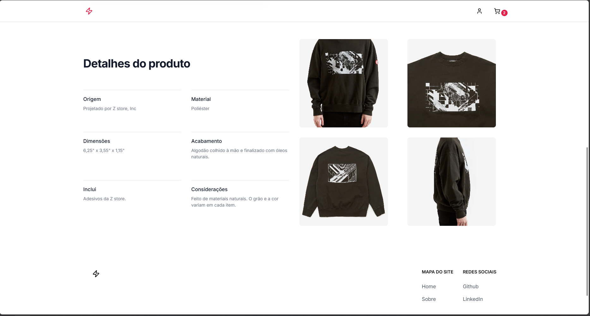
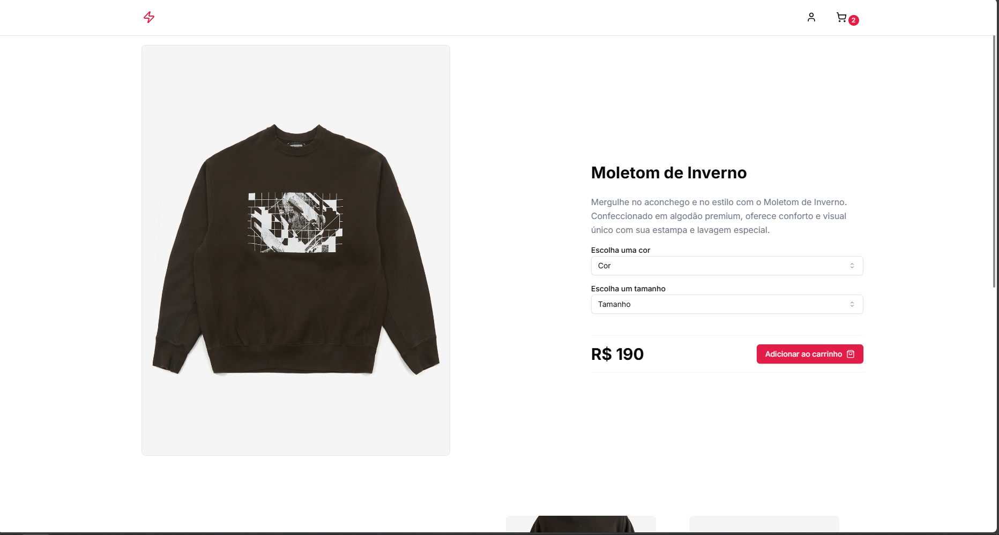
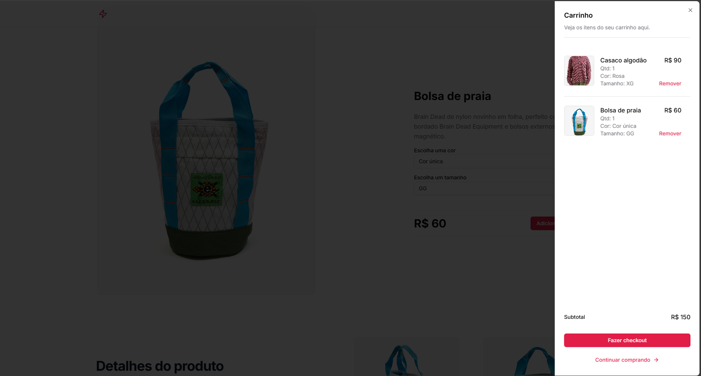
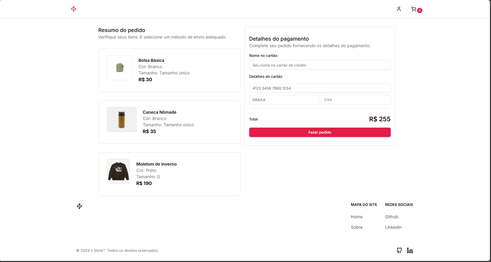

# Z Store - E-commerce Web Application

Z Store is a modern e-commerce web application built with React, TypeScript, and Vite. It offers a seamless shopping experience with features like product browsing, cart management, and secure checkout.







## Features

- Product catalog with detailed product pages
- Shopping cart functionality
- User authentication (sign up, sign in, sign out)
- Responsive design for various screen sizes
- Dark mode support
- Checkout process

## Technologies Used

- React
- TypeScript
- Vite
- Tailwind CSS
- Radix UI
- React Router
- Formik & Yup for form handling and validation
- Axios for API requests
- JSON Server for mock backend

## Getting Started

1. Clone the repository
2. Install dependencies:
   ```bash
   npm install
   ```
3. Start the development server:
   ```bash
   npm run dev
   ```
4. Start the mock backend server:
   ```bash
   npm run server
   ```

## Project Structure

- `/src`: Main source code directory
  - `/components`: Reusable React components
  - `/hooks`: Custom React hooks
  - `/interfaces`: TypeScript interfaces
  - `/lib`: Utility functions
  - `/network`: API client setup
  - `/pages`: Main page components
  - `/routes`: Route definitions

## Key Components

- Header: Contains navigation and cart elements
- Product Card: Displays individual product information
- Cart: Manages the shopping cart functionality
- Checkout Page: Handles the checkout process

## Authentication

The project uses a custom authentication system with context API.

## API Integration

API requests are made using Axios.

## Styling

The project uses Tailwind CSS for styling, with custom theme configuration.

## Contributing

Contributions are welcome! Please feel free to submit a Pull Request.

## License

This project is open source and available under the [MIT License](LICENSE).